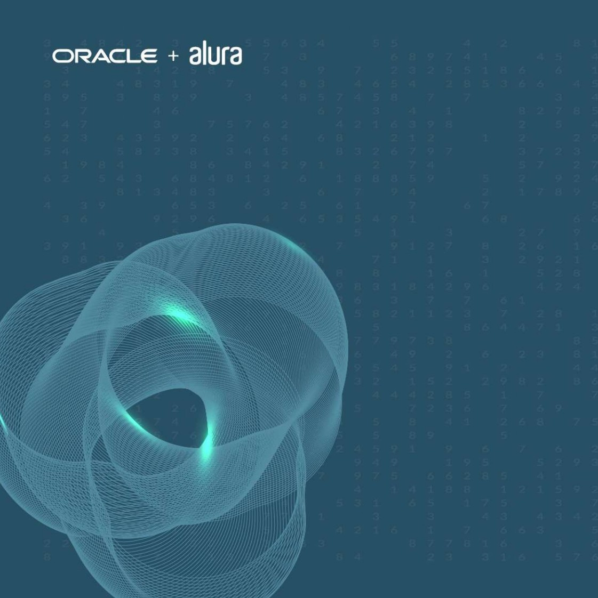

# Portifólio

### *Olá me chamo paulo e seja bem vindo ao meu projeto portifólio.*
**Este repositório abriga um projeto elaborado ao longo dos cursos de HTML e CSS oferecidos pela [Alura](https://www.alura.com.br/?srsltid=AfmBOopyc2qlYjKJS0pQm_TuhIkC9xkFm3xAqR5o_4WEmwovAgb8KVPZ) em colaboração com a [Oracle](https://www.oracle.com/br/education/oracle-next-education/), dentro do programa ONE - Oracle Next Education.
O objetivo do projeto é desenvolver um portfólio pessoal ilustrativo, servindo como prática para os conhecimentos adquiridos, incluindo a estruturação de páginas,
aplicação de estilos com CSS, design responsivo e publicação na web.**

## Ferramentas utilizadas:
- HTML5 - Estruturação do conteúdo.
- CSS3 - Estilos e layout.
- Flex-box -posicionamento do conteudo.

## Produzido por:
  ### *Paulo Henrique Rosa* 
 - ### [Linkedin](https://www.linkedin.com/in/paulo-henrique-rosa-dev/)

## Cursos do Projeto
✅ **HTML e CSS: Ambientes de desenvolvimento, estrutura de arquivos e tags**
 
✅ **HTML e CSS: Classes, posicionamento e Flexbox**
 
✅ **HTML e CSS: Cabeçalho, footer e variáveis CSS**
 
✅ **HTML e CSS: Trabalhando com responsividade e publicação de projetos**
## 📘 Documentação
- [Sintaxe básica de gravação e formatação no GitHub](https://docs.github.com/pt/get-started/writing-on-github/getting-started-with-writing-and-formatting-on-github/basic-writing-and-formatting-syntax)

- [CSS](https://www.w3schools.com/css/default.asp)

- [HTML](https://www.w3schools.com/html/default.asp)

- [ChatGPT](https://chatgpt.com/)

- [Curso git e Github](https://cursos.alura.com.br/course/git-github-compartilhando-colaborando-projetos)

- [Como escrever um README incrível no seu Github](https://www.alura.com.br/artigos/escrever-bom-readme)
